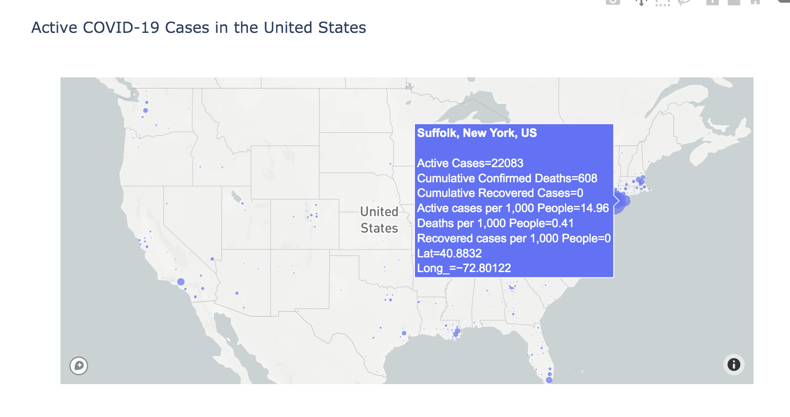

# python-assignment-2
Business Question: How can we visualize and better understand the overall toll of the COVID-19 pandemic on US counties or county equivalents? 

Data Analysis:

In the tutorial analysis, we created a bubble map tracking the cumulative number of COVID-19 cases in each county. For the purpose of this assignment, I decided to define the 'toll' as the number of active cases in each county. The nature of a pandemic is constantly shifting, and examining cumulative cases may not give decision-makers a completely accurate picture of which counties require the most resources. Currently, we are seeing some areas of the U.S. implementing stricter social distancing measures, whereas other areas are beginning to lift restrictions. An understanding what regions have the most ongoing cases will inform decisions about placing or lifting quarantine policies. One limitation of this analysis is that it may be difficult to distinguish between counties with a low number of active cases because of high recovery rate and a county with low active cases because of high mortality. To adjust for this, I also included the data for number of deaths and recoveries. It is important to standardize the data for the visualizations (instead of using raw data) to account for the differences in population sizes between counties and instead display cases/deaths/recoveries as a percentage of the population.

Business Answer: How might our data visualizations help county and state leadership or business owners in the US? What other data might we want to incorporate into an animated choropleth map to better understand the toll of the novel coronavirus in the United States?

The data visualizations performed in this analysis help to give us an understanding of how COVID-19 is spreading throughout the U.S. and which counties are being particularly affected by the pandemic. This is useful to policy-makers on local, state, and federal levels who must make decisions about how to regulate citizens and allocate resources. For example, the California government may see that there is a concentration of cases in beach towns and make the decision to close beaches in order to enforce stricter social distancing. Incorporating the rate of recovery into a choropleth map could help leaders determine what policies have been effective in slowing the rate of cases and improving mortality.

Links to data sources:
https://raw.githubusercontent.com/plotly/datasets/master/geojson-counties-fips.json
https://raw.githubusercontent.com/nytimes/covid-19-data/master/us-counties.csv
https://raw.githubusercontent.com/CSSEGISandData/COVID-19/master/csse_covid_19_data/csse_covid_19_daily_reports/04-14-2020.csv
